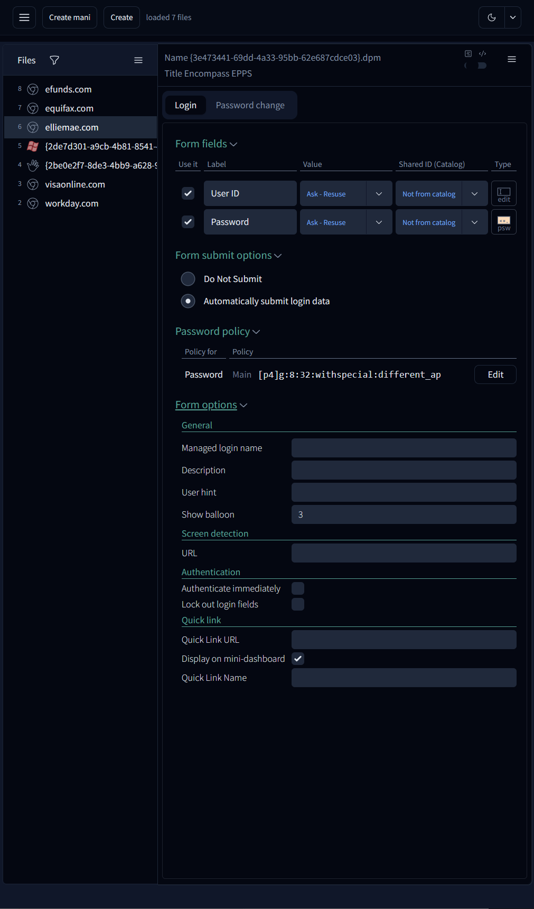
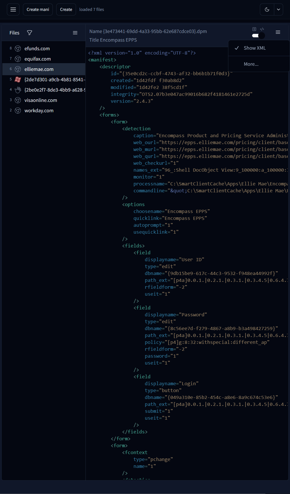
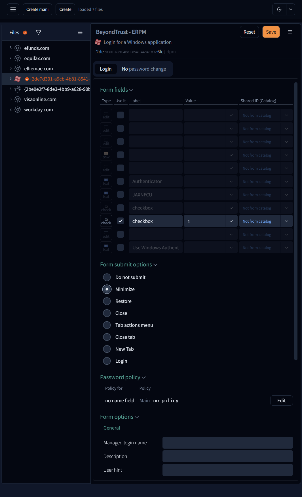

# electron-react: PMAT 2024 lite

An Electron application with React and TypeScript







## notes

From pmac project:
```ts
export type RootGroup = {
    rootFolder: string;         // this group root folder
    fnames: string[];           // fnames relative to the rootFolder wo/ the rootFolder but w/ possible sub-folders: A(InUse), B(NotInUse), and C(NotInUseTest).
};
```

## resources 

 * icon - https://seeklogo.com/vector-logo/450809/hid-global

## commands

* ```tsc -p tsconfig.web.json -w --noEmit```
* ```pnpm electron-builder --win``` - skip build and pack for testing only

## refs
* https://electron-vite.org/guide/dev
* https://www.electronjs.org/docs/latest/tutorial/context-isolation

## packages installation

```
p add -D @radix-ui/react-accordion @radix-ui/react-icons @radix-ui/react-slot class-variance-authority @radix-ui/react-checkbox @radix-ui/react-radio-group react-re
sizable-panels @radix-ui/react-scroll-area @radix-ui/react-select sonner @radix-ui/react-switch @radix-ui/react-tooltip
```

## asar archive

[G: how to view node js asar](https://stackoverflow.com/questions/38523617/how-to-unpack-an-asar-file)
``` pnpx @electron/asar extract app.asar <destfolder> ```

This is phone edit test

<div style="display: none">
## to many scripts:
    "scripts": {
        "dev": "electron-vite dev",
        "web": "vite --config electron.vite.config-browser.mts",
        "....................................................................................1": ".......................................................",
        "build": "pnpm run typecheck && electron-vite build",
        "preview": "electron-vite preview",
        "postinstall": "electron-builder install-app-deps",
        "....................................................................................2": ".......................................................",
        "build:win": "pnpm run build && electron-builder --win",
        "build:unpack": "pnpm run build && electron-builder --dir",
        "....................................................................................a": ".......................................................",
        "build:web": "vite --config electron.vite.config-browser.mts build --outDir ../../dist --emptyOutDir",
        "build:web:github": "vite --config electron.vite.config-browser.mts build --outDir ../../dist --emptyOutDir && gh-pages -d ./dist",
        "build:web:preview": "vite --config electron.vite.config-browser.mts preview --outDir ../../dist",
        "....................................................................................3": ".......................................................",
        "tsc": "tsc -w --noEmit -p tsconfig.web.json --composite false",
        "typecheck": "pnpm run typecheck:node && pnpm run typecheck:web",
        "typecheck:web": "tsc --noEmit -p tsconfig.web.json --composite false",
        "typecheck:node": "tsc --noEmit -p tsconfig.node.json --composite false",
        "....................................................................................4": ".......................................................",
        "build:mac": "electron-vite build && electron-builder --mac",
        "build:linux": "electron-vite build && electron-builder --linux",
        "....................................................................................5": "not-uused-now"
    }
</div>

## build
  * in case of electron error: "RequestError: self-signed certificate in certificate chain" add to user env variable

    ```bash
    set NODE_TLS_REJECT_UNAUTHORIZED=0
    ```
  * and turn off Cloudflare Warp before running the build

  * ```set VITE_CJS_IGNORE_WARNING=true && p web```